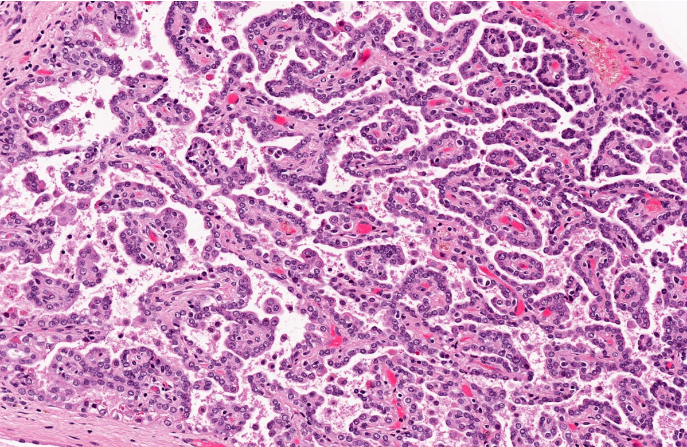

\newpage

# Estadificación de riesgo obstetrico en enfermedad reumática
- Gestas
- Partos
- HV
- HM

# Antecedentes Maternos
- Preeclampsia
- Eclampsia
- Otros

## This is my image

What shall I do to make this work on PDF?

{width=80%}

It works now!

## To run the code
pandoc --pdf-engine=pdflatex test.md -o test.pdf --citeproc

Here is a footnote reference,[^1] and another.

[My file](test.md) 

[^1]: Here is the footnote.


```
  qsort[]     = []
  qsort(x:xs) = qsort (filter (<x) xs) ++ [x] ++ qsort (filter (>= x) xs)
```
~~~~ {#mycode .haskell .numberLines startFrom="1"}
qsort []     = []
qsort (x:xs) = qsort (filter (< x) xs) ++ [x] ++
               qsort (filter (>= x) xs)
~~~~~~~~~~~~~~~~~~~~~~~~~~~~~~~~~~~~~~~~~~~~~~~~~

Term 1

:   Definition 1

Term 2 with *inline markup*

:   Definition 2

        { some code, part of Definition 2 }

    Third paragraph of definition 2.

(@)  My first example will be numbered (1).
(@)  My second example will be numbered (2).

(@good)  This is a good example.

As (@good) illustrates, ...

[This is a tested underlined text]{.underline}

Blah blah [@z1]

\newpage
# Reference
